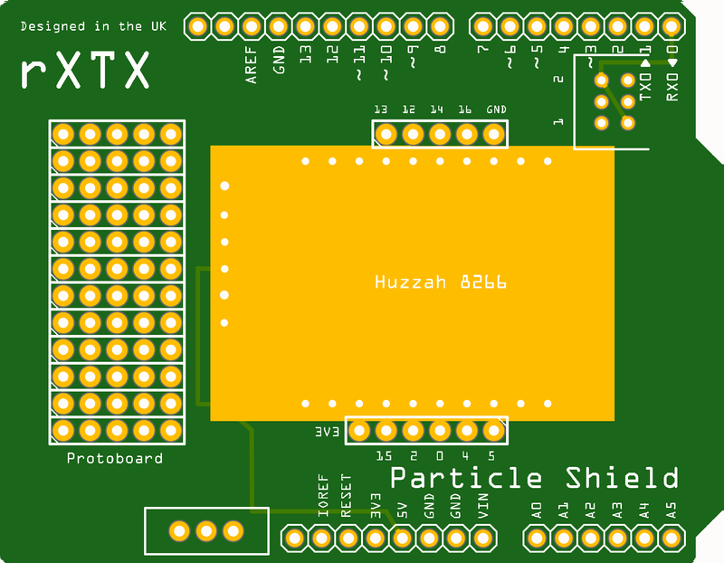
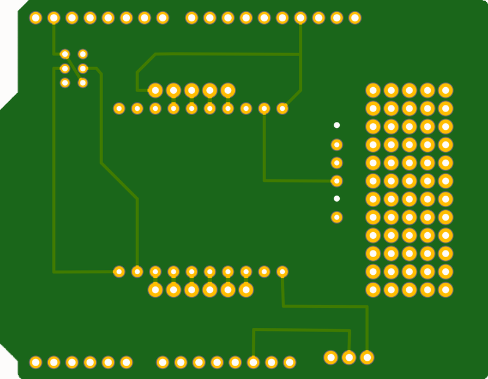

# Particle Shield: 2018 Edition

## About This Project

## Renderings

### Top

### Bottom

## BOM

|Count|Component|Details|Datasheet|
|-|-|-|-|
|1x|Adafruit HUZZAH ESP8266 Breakout1|ESP8266 HUZZAH BREAKOUT BOARD||
|1x|Part1|Microcontroller board, Uno [Arduino] A000066 Microcontroller board, Uno 7640152110092|[Link](http://datasheet.octopart.com/A000066-Arduino-datasheet-11009784.pdf)|
|1x|S2|SWITCH SLIDE SPDT 200MA 30V|[Link](http://spec_sheets.e-switch.com/specs/P040040.pdf)|

---

This project is managed and available on

You can view it [here](https://aisler.net/p/PYXPQRBM). Start your own Powerful Prototype on [here](https://aisler.net).
